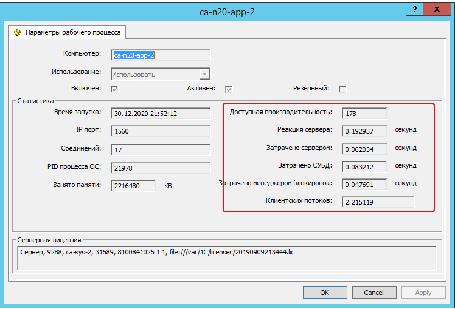
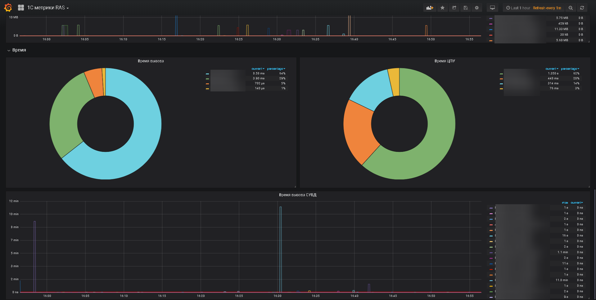
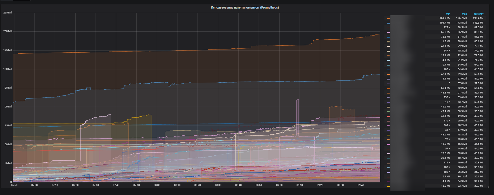
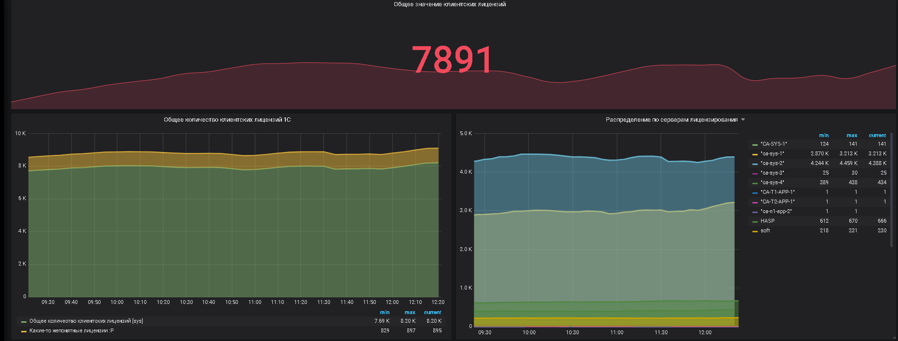
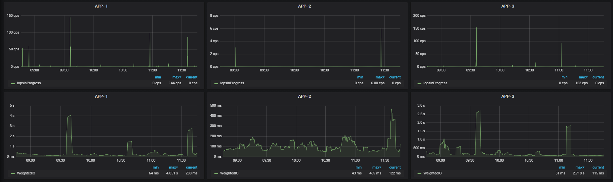
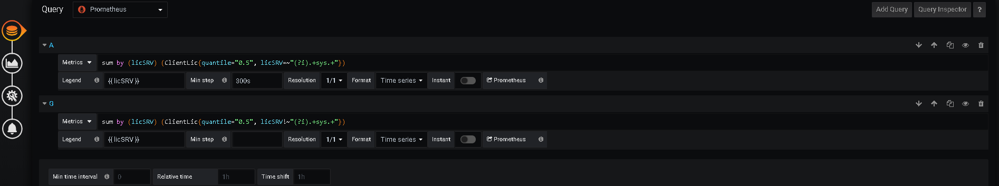

# prometheus_1C_exporter

Приложение выполняет роль explorer'а для prometheus. На текущий момент приложение собирает метрики:
* Используемые клиентские лицензии
* Доступную производительность серверов приложений
    * в том числе 
    
    
* Количество соединений
* Количество сеансов
* Текущая память процесса (получается из ОС, пока поддерживается только **linux**)
* Общая загрузка ЦПУ (получается из ОС)
* Метрики дикска (получается из ОС, пока только **linux**)
    * **WeightedIO** _(Это значение подсчитывает количество миллисекунд, в течение которых запросы ввода-вывода ожидали на этом блочном устройстве. Если имеется несколько ожидающих запросов ввода-вывода, это значение будет увеличиваться как произведение количества миллисекунд на количество ожидающих запросов.
    Например, если 60 запросов на чтение ждут в среднем 30 мс, поле read_time увеличится на 60 * 30 = 1800)_
    * **IopsInProgress** _(Это значение подсчитывает количество запросов ввода-вывода, которые были отправлены драйверу устройства, но еще не завершены. Он не включает запросы ввода-вывода, которые находятся в очереди, но еще не отправлены драйверу устройства). [Пример настройки дажборда](#iops)_
    * **ReadCount** _(Это значения увеличиваются при завершении запроса ввода-вывода)_
    * **WriteCount** _(Это значения увеличиваются при завершении запроса ввода-вывода)_
    * **IoTime** _(Это значение подсчитывает количество миллисекунд, в течение которых устройство помещало в очередь запросы ввода-вывода)_
* Проверка галки "блокировка регламентных заданий"
* Память всего
* Память текущая
* Чтение/Запись текущее
* Время вызова текущее
* Время вызова СУБД
* Процессорное время текущее

сборка показателей осуществляется через утилиту rac.
Каждую из метрик можно ставить на паузу, например такое может потребоваться в процессе обновления ИБ т.к. соединения RAC могут мешать этому процессу. Что бы поставить на паузу нужно отправить GET запрос

http://host:9091/Pause?metricNames=ProcData,SessionsMemory&offsetMin=1

где **metricNames** это метрики через запятую, **offsetMin** это пауза в минутах после которой автоматически включается сбор показателей. offsetMin - необязательный, если его не указывать сбор будет приостановлен будет пока явно его не запустить, запуск производится так:

http://host:9091/Continue?metricNames=ProcData,SessionsMemory

Имена метрик можно посмотреть в конфиге **settings.yaml**


### Начать использовать
- Скачать актуальный [релиз](https://github.com/LazarenkoA/prometheus_1C_exporter/releases ) 
- Собрать в ручном режиме. Ставим [Go](https://blog.golang.org/), `git clone https://github.com/LazarenkoA/prometheus_1C_exporter`, переходим в каталог, выполняем `go build -o "1C_exporter"` или `go build -o "1C_exporter.exe"`. 

**Запуск** 

./1C_exporter -port=9095 --settings=/usr/local/bin/settings.yaml

Если порт не указать по дефолту будет порт 9091


в конфииге прометеуса (prometheus.yml) нужно указать хосты на которых запущен explorer
```yaml
  - job_name: '1С_Metrics'
    metrics_path: '/1С_Metrics' 
    static_configs:
    - targets: ['host1:9091', 'host2:9091', 'host3:9091', 'host4:9091']
```
```golang
end:
```
Все, [настраиваем](#configure) дажборды, умиляемся. 

------------


### Contributors
Если захотите развить explorer, что бы собирались другие метрики, нужно:
Создать файл [name metrics].go в котором будет описан класс метрики, класс должен имплементировать интерфейс Iexplorer, после чего добавляем экземпляр класса к метрикам:
```golang
metric := new(Metrics)
metric.append(new(ExplorerClientLic).Construct(time.Second * 10))
// metric.append(новый explorer объект) 
}
```
```golang
goto end
```

**Примеры дажбордов**










### <a name="configure"></a>
Для данной конфигурации дажбордов (Клиентские лицензии) настройки графаны такие: 
* Создаем новый дажборд
* Query - prometheus
* в поле Metrics `sum by (licSRV) (ClientLic{quantile="0.5", licSRV=~"(?i).+sys.+"})`


экспортер выдает данные в таком виде
```
.....
ClientLic{host="CA-N11-APP-1",licSRV="\"ca-sys-1\"",quantile="0.5"} 193
ClientLic{host="CA-N11-APP-1",licSRV="\"ca-sys-1\"",quantile="0.9"} 193
ClientLic{host="CA-N11-APP-1",licSRV="\"ca-sys-1\"",quantile="0.99"} 193
ClientLic_sum{host="CA-N11-APP-1",licSRV="\"ca-sys-1\""} 193
ClientLic_count{host="CA-N11-APP-1",licSRV="\"ca-sys-1\""} 1
ClientLic{host="CA-N11-APP-1",licSRV="HASP",quantile="0.5"} 17
ClientLic{host="CA-N11-APP-1",licSRV="HASP",quantile="0.9"} 17
ClientLic{host="CA-N11-APP-1",licSRV="HASP",quantile="0.99"} 17
ClientLic_sum{host="CA-N11-APP-1",licSRV="HASP"} 17
ClientLic_count{host="CA-N11-APP-1",licSRV="HASP"} 1
ClientLic{host="CA-N11-APP-1",licSRV="soft",quantile="0.5"} 4
ClientLic{host="CA-N11-APP-1",licSRV="soft",quantile="0.9"} 4
ClientLic{host="CA-N11-APP-1",licSRV="soft",quantile="0.99"} 4
ClientLic_sum{host="CA-N11-APP-1",licSRV="soft"} 4
ClientLic_count{host="CA-N11-APP-1",licSRV="soft"} 1
.....
```
это можно проверить выполнив `curl http://localhost:9091/1C_Metrics` 

соответственно в примере `sum by (licSRV) (ClientLic{quantile="0.5", licSRV=~"(?i).+sys.+"})` мы берем метрику ClientLic
ту где quantile="0.5" и licSRV подходит к regexp `"(?i).+sys.+"`
Другие дажборды настраиваются по аналогии. Другие примеры функций можно посмотреть в 
[документации prometheus](https://prometheus.io/docs/prometheus/latest/querying/examples/)

### <a name="iops"></a>
Пример настройки графаны для дажборда по IOPS диска

`sum(disk{ node="$group", host=~"(?i).*app-1", quantile="0.5", metrics="IopsInProgress"})by (metrics) `

Ожидание на диске

`sum(rate(disk{ node="$group", host=~"(?i).*app-2", quantile="0.5", metrics="WeightedIO"}[5m])) by (metrics) `
