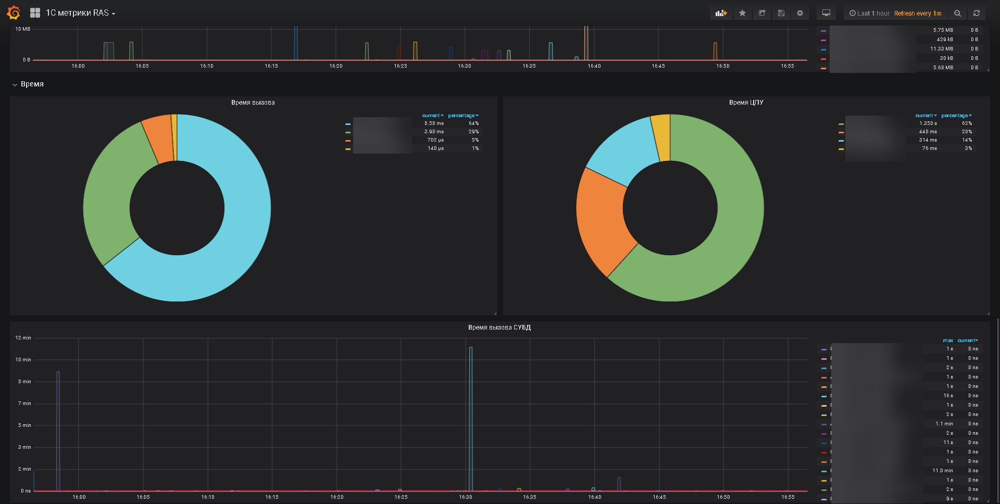
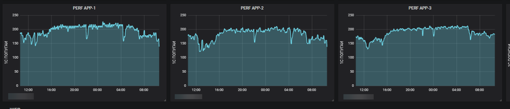
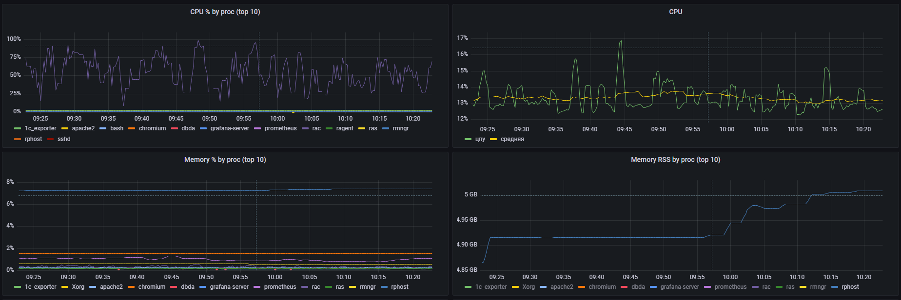
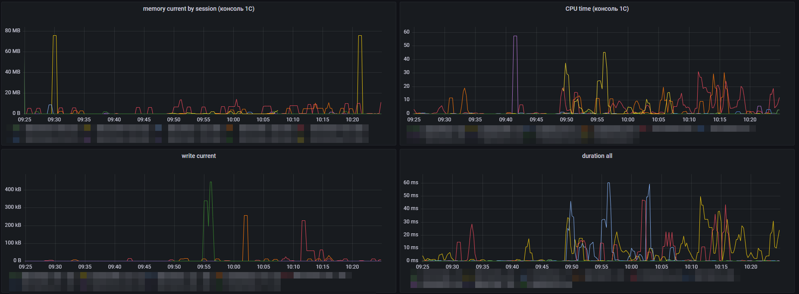

# Prometheus 1C Exporter

Многофункциональный экспортер метрик 1С для Prometheus с расширенными возможностями управления сбором данных.

## 🔍 Возможности

- Сбор ключевых метрик 1С через утилиту `rac`:
  - Клиентские лицензии
  - Производительность серверов приложений
  - Активные соединения и сеансы
  - Ресурсы процессов (память, CPU)
  - Состояние дисковых операций (IOPS, latency)
  - Статус регламентных заданий
  - И другие [показатели производительности](#-метрики)

- Гибкое управление сбором метрик:
  - Выборочная приостановка сбора
  - Автоматическое возобновление
  - Раздельные эндпоинты для разных типов метрик

- Готовые примеры визуализации для Grafana
- Поддержка работы в качестве службы (Windows/Linux)






## 📦 Установка

### Предварительные требования
- Go 1.19+ (для сборки из исходников)
- Доступ к утилите `rac`
- Prometheus 2.0+

### Способы установки:
1. **Готовые бинарники**:  
   [Скачать последний релиз](https://github.com/LazarenkoA/prometheus_1C_exporter/releases)

2. **Сборка из исходников**:
   ```bash
   git clone https://github.com/LazarenkoA/prometheus_1C_exporter
   cd prometheus_1C_exporter
   go build -o "1C_exporter"
   ```
## 🚀 Запуск
**Linux:**
```bash
./1C_exporter -port=9095 --settings=/path/to/settings.yaml
```
**Windows:**
```bash
./1C_exporter.exe -port=9095 --settings=/path/to/settings.yaml
```
пример настроек [examples_settings.yaml](examples_settings.yaml)


## ⚙️ Конфигурация Prometheus
Добавьте в `prometheus.yml`:
```yaml
scrape_configs:
  - job_name: '1c_metrics'
    scrape_interval: 30s
    metrics_path: '/metrics'
    static_configs:
      - targets: ['1c-server1:9091', '1c-server2:9091']
```    
Опционально: раздельные задания для разных типов метрик
```yaml
scrape_configs:
  - job_name: '1c_os_metrics'
    scrape_interval: 10s
    metrics_path: '/metrics_os'
    static_configs:
      - targets: ['1c-server1:9091']

  - job_name: '1c_rac_metrics'
    scrape_interval: 30s
    metrics_path: '/metrics_rac'
    static_configs:
      - targets: ['1c-server1:9091']
```    

## 🛠 Управление сбором метрик
| Метод | URL-формат | Параметры                         |
|-------|------------|-----------------------------------|
| GET   | /Pause      | metricNames<br/> offsetMin (опционально) |
| GET   | /Continue   | metricNames                      |
| POST  | /set_config |                       |

**Примеры:**
Приостановить сбор на 5 минут:
```
http://host:9091/Pause?metricNames=processes,connections&offsetMin=5
```

Возобновить сбор:
``` 
http://host:9091/Continue?metricNames=disk_metrics
```

Загрузить новый конфигурационный файл, с применением новых настроек:
``` 
curl -X POST http://localhost:9091/set_config -F "file=@settings.yml"
```

## 📊 Метрики
### Основные категории

Категория      | Метрики                       | Эндпоинт
---------------|-------------------------------|-----------------
Системные      | CPU, память, диски             | `/metrics_os`
RAC-метрики    | Лицензии, соединения, сеансы   | `/metrics_rac`
Композиционные | Все метрики                    | `/metrics`

### Детализация метрик

Метрика            | Описание                                  | Тип данных
-------------------|-------------------------------------------|-------------
`available_performance`   |   Доступная производительность хоста       | SummaryVec
`sessions_data`    |   Показатели сессий из кластера 1С     | SummaryVec
`session`  |    Сессии 1С        | SummaryVec и/или GaugeVec
`connect`       |    Соединения 1С         | SummaryVec
`client_lic`     |  Киентские лицензии 1С            | SummaryVec
`shedule_job`     |  Состояние галки "блокировка регламентных заданий", если галка установлена значение будет 1 иначе 0 или метрика будет отсутствовать            | Gauge
`cpu`     |  Метрики CPU общий процент загрузки процессора"             | SummaryVec
`processes`     |Метрики CPU/памяти в разрезе процессов              | SummaryVec
`disk`     |   Показатели дисков            | SummaryVec


## 📈 Примеры запросов PromQL
Клиентские лицензии:
```
sum by (licSRV) (client_lic{quantile="0.99", licSRV=~"(?i).+sys.+"})
```

Средняя загрузка CPU:
```
avg_over_time(cpu{quantile="0.99"} [1m])
```

Загрузка CPU в разрезе процессов:
```
topk(10, sum(avg_over_time(processes{quantile="0.99", metrics="cpu"}[1m])) by (procName) )
```

Загрузка ОЗУ в разрезе процессов:
```
topk(10, sum(avg_over_time(processes{quantile="0.99", metrics="memoryRSS"}[1m])) by (procName) )
```

Доступная производительность 1С:
```
avg_over_time(available_performance{quantile="0.99"}[10m])
```

Количество сеансов в 1С:
```
session{quantile="0.99"}
```

CPU time (консоль 1С)
```
rate(sessions_data{quantile="0.99", datatype="cputimetotal"}[5m])
```

## ⚠️ Локализация ошибок
При возникновении проблем проверьте:
- Доступность RAC-утилиты
- Права на чтение конфигурационного файла
- Открытые порты в firewall
- Логи приложения (режим отладки через установку уровня логирования `LogLevel: 5` в конфигурационном файле)